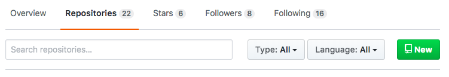

# How To Git

Git is a version control system for developers. Think of it as creating save files, or snapshots of your project, much like a save button for a Word document.
It's good to take a look at [Git Documentation](https://git-scm.com/book/en/v2) for any question you may have.

#### Installing Git

**On Mac's** we can install XCode, which installs git automatically.
Run the following command on your terminal.
- `$ git --version` 
A XCode prompt should appear and you should just follow the installing instructions.

**On Windows** you can install manually by downloading [here](https://git-scm.com/download/win).
You can check if you install and what version are you running just typing this command on your terminal.
- `$ git --version` 

#### Using GitHub

GitHub is a central 'hub' where developers store their projects and are able to contribute in open source projects. 

- [Create Github account](https://github.com/join)

When creating and working on a project you should make sure to commit in every change and or feature you add to your project. 
Here is a step by step on how to work with GitHub.

Tell Git who you are. 
-`$ git config --global user.email email@mail.com`
-`$ git config --global user.name Name`
You will probably just need to run this once. 

**Create a repository on [Github.com](https://github.com/)**

- Go to your repositories and then click `New`
- pick a name for the repo (ie `javascript-practice`). It should be descriptive and match what your project represents
- copy the address of the git repo (should end with a .git) on the second step bellow.

**Initializing your local repository**
First you need to make sure you are in the right folder. Navigate to your project folder you can [check this sheet](https://learntocodewith.me/command-line/unix-command-cheat-sheet/clear) with terminal commands that will help you to get to your project folder.

After you are in your project folder, we need to initialize your local git repository:

-To initialize your repository. You should do this **only once** per project
-`git init`
-To point your local repo to the repo on GH you created in the previous step after this, your project is ready for staging and committing!
-`git remote add origin https://github.com/your-repository-url`

Now you have your local repository connect to your GitHub repository. Now it's time to code, and every change and or every feature you add you should commit, which would save a version of your project onto your GitHub repo.

**Commiting and pushing**
After making changes, save document and:
- `git add .`
- `git commit -m 'my very descriptive commit message'`
- `git push origin master ` (optional, you do not necessarily have to push every time)
- get back to your code, make changes, and repeat!
- use `git status` to make sure all changes have been pushed!
***You will use these 3 commands repeatedly, so remember these!***

## Basic Terms
Git: As stated above, Git is a version control system to keep track of revisions so that developers can review and keep track of changes made to a project.

**Github:** Is a central 'hub' where developers store their projects.

**Repository (repo):** A location for where a project is stored. Each project should always have it's own repo.

**Stage:** To stage a commit means to bundle all the changes you have made to a project and 'stage' it for a save.

**Commit:** To commit a project means to take all the changes and save it as a snapshot of the current state.

**Pushing:** Once you have committed your project, you are able to push your local project to Github. You are essentially pushing your project to a remote server.

**Pulling:** Sometimes you work with other developers and will be working on two different states of the project. If your friend had pushed some changes to the repo that you are both working on, you will need to pull the repo to get any changes that your friend had made.

## Basic Steps
For every project, you will usually need to do 3 things first.
1. Create a repo on Github.com
2. Initialize the repository on your local computer
3. Link them together

## Advanced

#### Clone a repo
Cloning a repo means you will be collaborating or adding to an existing repo that somebody else has created. This is extremely useful for team projects. In order to 'clone' somebody else's repo onto your computer so you can use it:
- go to the Github.com project URL
- Click on the green clone icon and copy the address
- open your terminal and `cd` into your PARENT folder (ie /user/Brainstation)
- type `git clone` + `cmd + v` to paste the address. it should look like - `git clone https://github.com/username/javascript-stuff.git` and press `enter`
- this will create `/user/Brainstation/javascript-stuff/`
- go into the folder with `cd javascript-stuff`
- now you can make changes, stage and commit!

<!-- forking repo -->
<!-- switching branches -->

