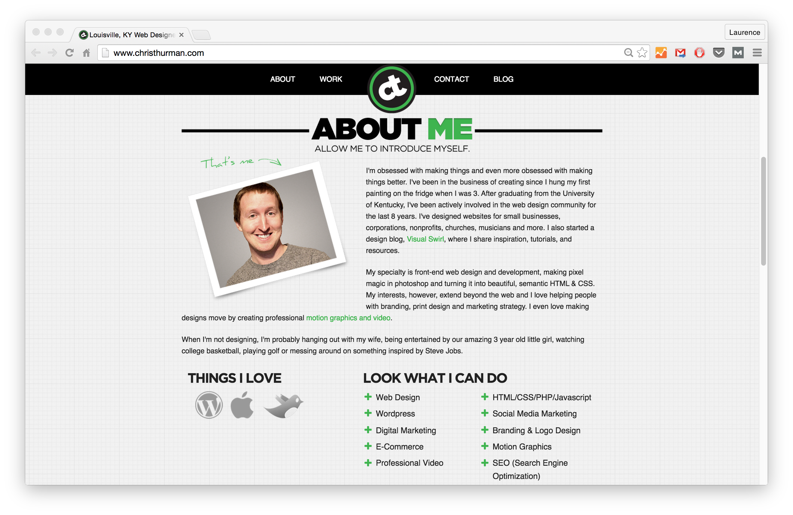

[Home](/README.MD) | [Week 1](../../week-01/ReadMe.md) | [Week 2](../../week-02/ReadMe.md) | [Week 3](../../week-03/ReadMe.md) | [Week 4](../../week-04/ReadMe.md) | [Week 5](../../week-05/ReadMe.md) | [Week 6](../../week-06/ReadMe.md) | [Week 7](../../week-07/ReadMe.md) | [Week 8](../../week-08/ReadMe.md) | [Week 9/10](../../week-09_10/ReadMe.md)

Labs: 1 | [2](./lab-02.md) | [3](./lab-03.md) | [4](./lab-04.md) | [5](./lab-05.md) | [6](./lab-06.md) | [7](./lab-07.md) | [8](./lab-08.md) | [9](./lab-09.md)

---

# Week 1 > Lab 1

### Build a Personal Portfolio Page with HTML
You will be creating a portfolio website for yourself using HTML, and then styling it using CSS. You will learn the basic structure and components which build a webpage. Keep in mind that you are going to work on this portfolio throughout the whole 10 weeks, until we have a deployed version of it. We will implement all the new technologies that we learn on your portfolio.

For example:

#### Objective
This lab introduces you to creating HTML pages and stying them with CSS. By the end, you should be comfortable working with HTML/CSS and understand the structure of an HTML document.

#### Prerequisites
Using your terminal, create a `portfolio` folder with the `mkdir` command in your `brainstation/labs` folder. Create a Git repository for the portfolio project. Refer [here](../../references/github.md) if you need a refresher on how to use Git!

#### Part 1 - HTML Skeleton
Create a basic HTML structure for your portfolio site. You should be sure to include the following tags in your site: `h1`, `h2`, `h3`, `p`, `a`, `ol` or `ul`, `li`, `div`, `span`, `nav` and `img`. For reference on what these tags are and how to use them check out [W3Schools HTML Reference](https://www.w3schools.com/tags/)

- Using VSCode, create an HTML page called `index.html`. This will be the starting page, or home page for your portfolio site.
- Add a heading with your name and title (e.g. John, Web Developer). You could use a `
` for this with nested `<h1>` and `<h2>` tags for this.
- Add a bio or summary of yourself. Try using `
` for the bio content and an `<h2>` tag for the Bio heading.
- Add a logo or an image of yourself using the `` tag.
- Link your Github as a text link (`<a>`).
- List of some professional skills you have. Use the `<ul>` tag.
- Anything else you want on your page, be creative!
- **Bonus:** Have a BrainStation icon link to the BrainStation website.

#### Part 2 - CSS Styling
Create some styling for your website. Use [W3 Schools CSS Reference](https://www.w3schools.com/cssref/default.asp) for help. Experiment with using element selectors (e.g. `p`), class selectors (e.g. `.bold`), and id selectors (e.g. `#bio`)

- Add the `<style>` tag to your page where you can add your style rules.
- Change the text size of your paragraphs.
- Change color of one of the paragraphs using a class
- Add a background color to the page
- Add a border around a `
`
- **Bonus:** Add a background pattern using an image from [Subtle Patterns](https://www.toptal.com/designers/subtlepatterns/)

#### Part 3 - Stylesheets
Extract your style rules to an external style sheet.
- Create and link your documents to the `styles.css` file
- Add an ID of `header-title` to your header title and style it
- Add a class of `paragraph` to all `p` tags and style it

---
[Week 1 Home](../ReadMe.md) | [Go to Lab 2 >>](./lab-02.md)
