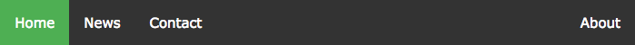
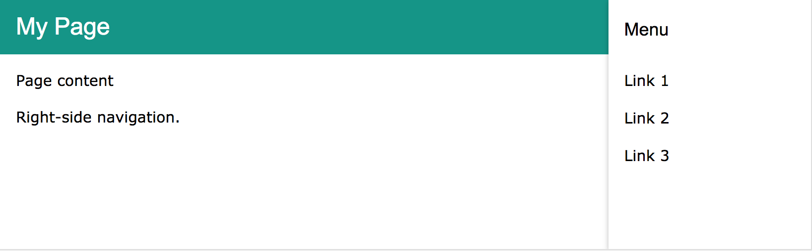

[Home](/README.MD) | [Week 1](../../week-01/ReadMe.md) | [Week 2](../../week-02/ReadMe.md) | [Week 3](../../week-03/ReadMe.md) | [Week 4](../../week-04/ReadMe.md) | [Week 5](../../week-05/ReadMe.md) | [Week 6](../../week-06/ReadMe.md) | [Week 7](../../week-07/ReadMe.md) | [Week 8](../../week-08/ReadMe.md) | [Week 9/10](../../week-09_10/ReadMe.md)

Labs: [1](./lab-01.md) | 2 | [3](./lab-03.md) | [4](./lab-04.md) | [5](./lab-05.md) | [6](./lab-06.md) | [7](./lab-07.md) | [8](./lab-08.md) | [9](./lab-09.md)

---

# Week 1 > Lab 2

### Portfolio: Using Box Model and Positioning
You will further style your portfolio and apply your knowledge of the box model and positioning, along with adding a navbar and sidebar component!

#### Objective
This lab will introduce you to using the [Box Model](https://www.w3schools.com/css/css_boxmodel.asp) and positioning elements. By the end of the lab, you should be comfortable with Margin/Padding/Borders and repositioning HTML elements.

#### Prerequisites
Open up the portfolio project we worked on in lab 1 in VSCode. We will be adding to your portfolio.

#### Part 1 - Add a Navigation Bar

Sample HTML Navigation Bar:

- Add a nav bar with links to the following pages:
  - Home
  - Bio / About
  - Contact
  - *You don't have to worry about creating separate HTML pages for now, the idea is to create anchor tags and we'll link them up later this week.*
- Create a div or nav tag and style it so that it spans the whole width of the page and the height is 55px with a custom background color
- Add padding of 20px on both left and right sides of the div
- Add a title in the navigation bar
- Add anchors for `home`, `about`, and `contact` and position them to the right (Note: right now, they won't go anywhere, we'll add that later)

#### Part 2 - Sidebar

Create a sidebar to list your contact information. The contact info can be placeholders and does not have to reflect your real info. *(Note: Whenever submitting code to GitHub remember that everything is public. Make sure that things that you want to keep private - like your phone number, address, or email - shouldn't be in the files that you push.)*

- Create a div that acts as a sidebar and align it to the right side of the page
- The sidebar should span the whole height of the content below the navbar
- List your contact information in the sidebar
- Add some margins/padding to the contact info as appropriate

---
[Week 1 Home](../ReadMe.md) | [Go to Lab 3 >>](./lab-03.md)
