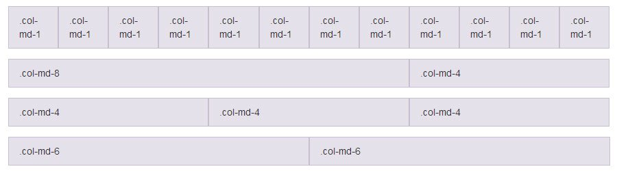

[Home](/README.MD) | [Week 1](../../week-01/ReadMe.md) | [Week 2](../../week-02/ReadMe.md) | [Week 3](../../week-03/ReadMe.md) | [Week 4](../../week-04/ReadMe.md) | [Week 5](../../week-05/ReadMe.md) | [Week 6](../../week-06/ReadMe.md) | [Week 7](../../week-07/ReadMe.md) | [Week 8](../../week-08/ReadMe.md) | [Week 9/10](../../week-09_10/ReadMe.md)

Labs: [1](./lab-01.md) | [2](./lab-02.md) | [3](./lab-03.md) | 4 | [5](./lab-05.md) | [6](./lab-06.md) | [7](./lab-07.md) | [8](./lab-08.md) | [9](./lab-09.md)

---

# Week 1 > Lab 4

### Portfolio (Bootstrap)
Now that you have learned about Bootstrap, let's provide structure and responsiveness to our portfolio and take advantage of the default styling Bootstrap provides.

#### Objective
This lab will introduce you to Bootstrap components and using a Bootstrap grid.

#### Prerequisites
- Open up the portfolio project we worked on in lab 1 in VSCode. We will be adding to your portfolio
- Add the necessary links from [Boostrap CDN](https://www.bootstrapcdn.com/) to the `<head>` for your portfolio page
- You will be using Bootstrap's custom Javascript library as well. You will need to link to a 'script' called [jQuery](https://code.jquery.com/) for some of the functionality. Note that sometimes, order matters. To be safe, put the script link for jQuery before the links to Bootstrap (we will learn more about what jQuery is soon)

#### Part 1 - Navbar
We will now be using [Bootstrap's Navbar](https://getbootstrap.com/docs/4.0/components/navbar/) instead of the HTML one that you created. Time to get rid of it!
- Remove your old HTML Navbar you made completely from the document
- Try to implement Bootstrap's Navbar component into your site
- Make sure to have `Home`, `About`, and `Contact` on the Navbar links
- You may add in an optional title if you'd like

#### Part 2 - Bootstrap Grid

Sample Bootstrap Grid:

Remember that your page width equals 12 'columns'. You can your width into columns, to which you can specify how many individual columns you can assign to. An example grid would look something like this:
```
<div class="row">
  <div class="col-md-4">This column is 4 wide</div>
  <div class="col-md-8">This column is 8 wide</div>
</div>
```


- Convert your existing content to take advantage of the Grid provided by bootstrap.
- Your content and your side bar should be implemented in their own bootstrap columns.

#### Part 3 - Responsive!
Responsiveness plays a key role in how people view websites nowadays. Make sure your site does not break on mobile!
- Open up the "Developer Tools" in your browser. Switch to the Responsive View and test the responsivity of your page.
- Make sure the Nav and page is responsive
- On small screens, your Navbar should collapse into a "hamburger" menu. Does it open and close the links?

---
[Week 1 Home](../ReadMe.md) | [Go to Lab 5 >>](./lab-05.md)
