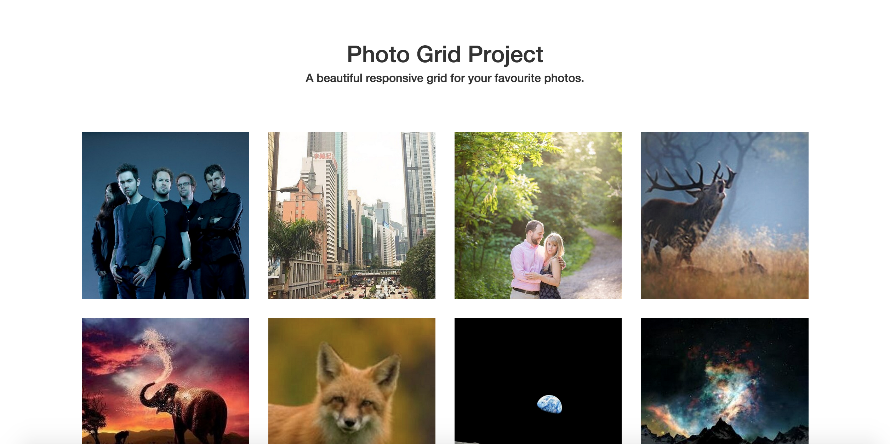

[Home](/README.MD) | [Week 1](../../week-01/ReadMe.md) | [Week 2](../../week-02/ReadMe.md) | [Week 3](../../week-03/ReadMe.md) | [Week 4](../../week-04/ReadMe.md) | [Week 5](../../week-05/ReadMe.md) | [Week 6](../../week-06/ReadMe.md) | [Week 7](../../week-07/ReadMe.md) | [Week 8](../../week-08/ReadMe.md) | [Week 9/10](../../week-09_10/ReadMe.md)

Labs: [1](./lab-01.md) | [2](./lab-02.md) | [3](./lab-03.md) | [4](./lab-04.md) | 5 | [6](./lab-06.md) | [7](./lab-07.md) | [8](./lab-08.md) | [9](./lab-09.md)

---

# Week 1 > Lab 5

### Instagram-Style Gallery
This project will give you the opportunity to explore the Bootstrap Grid System by building a responsive photo grid that is common across the web. The gallery should respond to large, medium and small screens.

#### Objective
This lab will go deeper with Bootstrap and help you practice using the grid layout for different display sizes, as well as responsive images

#### Prerequisites
Create a folder for this lab. Create an `index.html` with the default html starter code in VSCode

You should aim to design your project like this: 

Sample images can be found in [/public/resources/week-01/lab-05](/public/resources/week-01/lab-05).

#### Requirements
- Add Bootstrap via CDN to your project
- Add a Bootstrap [Jumbotron](https://getbootstrap.com/docs/4.0/components/jumbotron/) for your page header and title
- Use the following classes in your project: `container`, `row`, `col`, `text-center`, `jumbotron`
- Include at least 8 pictures. You can set the size, or learn how to use the `img-fluid` class
- Your page should respond to large, medium and small screens (4 column grid in a large display, 3 column grid in medium display, 2 column grid in small display, single column in extra small display)
- Your page should contain minimal custom styling, and should rely on the Bootstrap classes to do the work for you

---
[Week 1 Home](../ReadMe.md) | [Go to Lab 6 >>](./lab-06.md)
