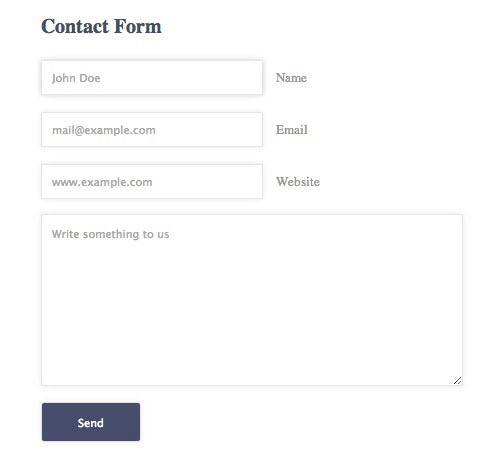

[Home](/README.MD) | [Week 1](../../week-01/ReadMe.md) | [Week 2](../../week-02/ReadMe.md) | [Week 3](../../week-03/ReadMe.md) | [Week 4](../../week-04/ReadMe.md) | [Week 5](../../week-05/ReadMe.md) | [Week 6](../../week-06/ReadMe.md) | [Week 7](../../week-07/ReadMe.md) | [Week 8](../../week-08/ReadMe.md) | [Week 9/10](../../week-09_10/ReadMe.md)

Labs: [1](./lab-01.md) | [2](./lab-02.md) | [3](./lab-03.md) | [4](./lab-04.md) | [5](./lab-05.md) | [6](./lab-06.md) | 7 | [8](./lab-08.md) | [9](./lab-09.md)

---

# Week 1 > Lab 7

### Using HTML Forms and jQuery

#### Objective
This lab has two goals:
- Introduce you to HTML Forms and the basics of how to get input from a user
- Introduce you to jQuery and Javascript Events so that you can respond to user input.

#### Prerequisites
- Open up the portfolio project we started in lab 1 in VSCode.
- include Bootstrap and jQuery CDN script links 
- Understand how jQuery interacts with the DOM and the importance of the document being loaded before our jQuery runs. Read more [here](https://api.jquery.com/ready/)

#### Part 1 - HTML Forms



On `contact.html`, add a form so that people can contact you. For now it won't be functional, but we can build the user interface portion.
- Create a form that takes in "Full name", "Email address", and "Message"
- Use Bootstrap classes like `form-group` and `form-control`. For help with the Bootstrap form components, check out the [documentation](http://getbootstrap.com/docs/4.1/components/forms/)
- Create a Bootstrap submit button
- Make sure the form is aligned properly. You can contain the form within a `col` so that it takes up a specific width (hint: look into `col-offset`)
- How can we add placeholder text to the input fields?
- **Bonus:** Try adding other types of form input to get comfortable with how they work (some form elements work a bit differently from others)

#### Part 2 - jQuery Events
Let's play around with some jQuery events. On the same `contact.html` page, we will attach some events to the `submit` button for practice.
- all jQuery code must be inside of `<script></script>` tags. It is common to include the `<script>` tags at the end of the `<head>`, or just above the `</body>` of the HTML document
- On clicking the `submit` button, use the Javascript `alert()` show a message on the screen (For help, see the documentation on [click()](https://api.jquery.com/click/) and [alert()](https://www.w3schools.com/jsref/met_win_alert.asp))
- Try adding an image and have it `fadeIn()` after the document has loaded ([documentation](http://api.jquery.com/fadein/))

#### Part 3 - Retrieving Input Values
- Modify what happens when the user clicks on the submit button so that: the alert displays what the user typed in
- You can get the values of the input using the `id` of the input element with jquery (e.g. `$("#fullName").val()`). For help, see the [jQuery .val() documentation](https://api.jquery.com/val/#val)


#### Part 4 - Append/Prepend
In addition to responding to events, jQuery can also modify the DOM. That's in fact the main reason that jQuery was created. Let's move to the `about.html` page.
- Create a short summary of what services you offer as a Jr Developer in a `<p>` tag with an ID of `aboutSummary`
- Use jQuery's `append()` to add another sentence to the above summary
- Use jQuery's `prepend()` to the Navbar component and add another link


#### Part 5 - Linking to external JS files.
We can attach an external Javascript file to your document, much like how you can attach an external CSS file. This allows us to separate the JS code from the HTML to keep an organized structure. To include a JS file in an HTML we can use the `<script>` tags as follows:

```html
<script src="main.js"></script>
```
- Take all of your jQuery and put it in a separate JS file, and then attach it to your HTML. Nothing should change, except your JS code is all together in one file.

#### Completion
You might notice that once you refresh the page, it goes back to its original state. This is because we are only temporarily manipulating the DOM inside the browser. We are not actually permanently modifying the HTML file that the browser loaded.

---
[Week 1 Home](../ReadMe.md) | [Go to Lab 8 >>](./lab-08.md)
