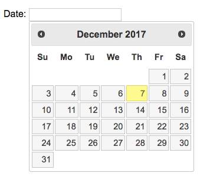

[Home](/README.MD) | [Week 1](../../week-01/ReadMe.md) | [Week 2](../../week-02/ReadMe.md) | [Week 3](../../week-03/ReadMe.md) | [Week 4](../../week-04/ReadMe.md) | [Week 5](../../week-05/ReadMe.md) | [Week 6](../../week-06/ReadMe.md) | [Week 7](../../week-07/ReadMe.md) | [Week 8](../../week-08/ReadMe.md) | [Week 9/10](../../week-09_10/ReadMe.md)

Labs: [1](./lab-01.md) | [2](./lab-02.md) | [3](./lab-03.md) | [4](./lab-04.md) | [5](./lab-05.md) | [6](./lab-06.md) | [7](./lab-07.md) | 8 | [9](./lab-09.md)

---

# Week 1 > Lab 8

### Using jQuery UI elements
jQuery is a powerful library that, in addition to DOM manipulation, provides many UI components that would be very difficult to make from scratch. We will take a look at jQuery UI and add some UI elements to our portfolio for practice.

#### Objective
This lab takes you deeper into jQuery. You should be familiar with the jQueryUI elements available to you, as well as be more comfortable with the syntax of using jQuery, and getting the help you need from the documentation.

#### Prerequisites
- jQuery CDN (which you already should have)
- jQueryUI needs to be included just like the core jQuery library Link to the CDN [here](https://code.jquery.com/ui/))
- Remember that all jQuery needs to be inside `<script>` tags, and that you need to make sure that the document is fully loaded before using jQuery on any elements.

#### Part 1 - Accordion
In the `index.html` file, we will be adding a [jQuery accordion](http://api.jqueryui.com/accordion/). It should look something like this:

- Think of 3 services that you may offer as a front-end developer (e.g. Building a Web Site, Redesigning existing websites, Making websites responsive). Each service should also have a short 1 - 2 sentence description. If you can't think of anything, you can use filler text from [Lorem Ipsum](https://www.lipsum.com/)
- Include the title section with a collapsable section to add your service descriptions
- Explore the different options to get comfortable with how you can use jQuery to manipulate the behaviour of different elements.

#### Part 2 - Calendar
On the `contact.html` page as part of your form, add a jQuery date-picker widget. It should look something like below:

- Add a section in the form that has a `label` and an `input`
- Include the `datepicker` inside the `<script>` tags
- Modify your *submit* button to also display the value of the date when clicked

#### Part 3 - Draggable
Experiment with jQueryUI *draggable* feature. This adds another level of interactivity by adding in a draggable feature with jQuery. To see some of the ways draggable can be used, check out the [Draggable documentation](https://jqueryui.com/draggable/#default)
- On your `index.html` home page, add 3 images. Give the images `class="draggableImg"`
- implement `draggable()` to your images in your `<script>` tags

---
[Week 1 Home](../ReadMe.md) | [Go to Lab 9 >>](./lab-09.md)
