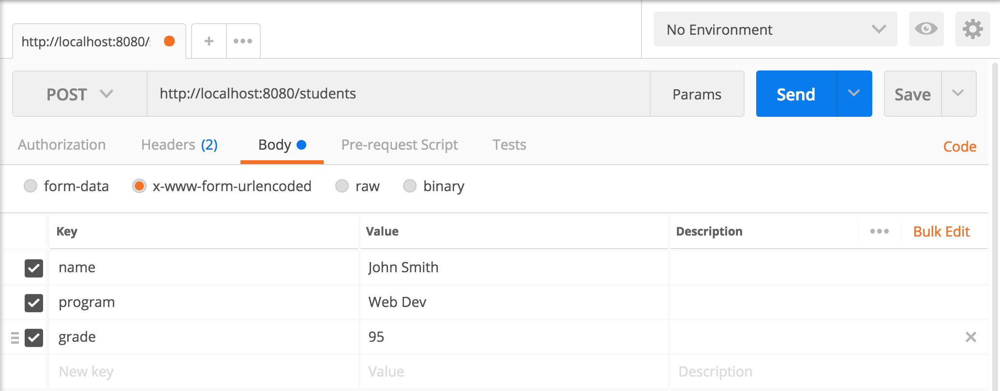

[Home](/README.MD) | [Week 1](../../week-01/ReadMe.md) | [Week 2](../../week-02/ReadMe.md) | [Week 3](../../week-03/ReadMe.md) | [Week 4](../../week-04/ReadMe.md) | [Week 5](../../week-05/ReadMe.md) | [Week 6](../../week-06/ReadMe.md) | [Week 7](../../week-07/ReadMe.md) | [Week 8](../../week-08/ReadMe.md) | [Week 9/10](../../week-09_10/ReadMe.md)

Labs: [1](./lab-01.md) | [2](./lab-02.md) | [3](./lab-03.md) | [4](./lab-04.md) | [5](./lab-05.md) | [6](./lab-06.md) | [7](./lab-07.md) | [8](./lab-08.md) | 9

---

# Week 3 > Lab 9

### RESTful APIs

RESTful APIs are Web APIs that are in the form of URLs. This lab will introduce the fundamental concepts.

#### Objective

#### Prerequisites

1. In `server.js` set up express to listen on port `8080`
2. Add the following array to `server.js`:

```JavaScript
const students = [
  {
    name: 'Brynhildr Sadler',
    program: 'Web Dev',
    grade: 75
  },
  {
    name: 'Joan Leon',
    program: 'UX',
    grade: 72
  },
  {
    name: 'Mark Summers',
    program: 'Web Dev',
    grade: 87
  },
  {
    name: 'Tanja Zawisza',
    program: 'Web Dev',
    grade: 92
  },
  {
    name: 'Slavomir Amato',
    program: 'UX',
    grade: 78
  },
  {
    name: 'Tihana Anand',
    program: 'UX',
    grade: 60
  },
  {
    name: 'Reima Ivov',
    program: 'Web Dev',
    grade: 95
  },
  {
    name: 'Demokritos Shafir',
    program: 'UX',
    grade: 83
  }
]
```

#### Part 1 - GET Requests

- Write a GET endpoint called `/students` that returns the array of students.

#### Part 2 - URL Parameters

- Add a new GET endpoint `/students` that will check for a URL parameter called `program` (e.g `/students/ux`)

*Hint 1: You can use [req.params](https://expressjs.com/en/api.html#req.params) to check for url parameters*

*Hint 2: You can declare URL Parameters in express using the `:` (e.g. `/students/:program`)*

#### Part 3 - Query Parameters

- Modify the `students` endpoint to check for a query parameter called `name`. If provided, return the information for the student matching the name. (e.g. `/students?name=Reima+Ivov`). If only a first name or last name is provided, return any students that have the provided name in either their first name or last name.
- Modify the `students` endpoint to check for a query parameter called `sort` that is either `grade` or `name`. (e.g. `/students?sort=grade`).
    - If a query parameter provided for sort is `grade` return the list of students sorted by their grade
    - If the query parameter provided for sort is `name` return the list of students sorted by their name.

*Hint 1: You can use [req.query](https://expressjs.com/en/api.html#req.query) to check for query parameters*
*Hint 2: You can use the [sort](https://developer.mozilla.org/en-US/docs/Web/JavaScript/Reference/Global_Objects/Array/sort) higher order function to sort the students. You may have to provide your own sorting function to sort the way that you want.*

#### Part 4 - POST Requests

- Create an POST endpoint that will be used for adding new students. You can create a separate endpoint (e.g. `/addstudent`) or you can use `/students` but define a new method using POST. Express will call the endpoint based on the Method that the client uses. So technically even if an endpoint shares the same URL, as long as the method is different, it is treated as a separate end-point.

- In order to get the parameters from a post request, we will use an npm library called '(body-parser)[https://www.npmjs.com/package/body-parser]'. You will need to npm install 'body-parser' and use the following code to set it up:

```Javascript
const bodyParser = require('body-parser')

// parse application/x-www-form-urlencoded
// This will parse a request body sent using an HTML Form
app.use(bodyParser.urlencoded({ extended: false }))

// parse application/json
// This will parse a request body sent using JSON
app.use(bodyParser.json())
```

**Note:** There are different types of data that can be sent in the body of a request. A form generally sends the information in the format for `username=John&email=john@email.com`. Setting the `bodyParser.userlencode({ extended: false })` enabled the express server to recognize data in that format. It is also possible to send data as a JSON object, using `bodyParser.json()` will allow express to receive JSON. In the future, we will use the JSON format because we will be writing more complex apps that use Javascript to send data to the server, rather than HTML forms.

- Now you can use `req.body` to check for any post parameters sent by the client. You will want to get `name`, `program`, and `grade`. Add the new student to your array.

- Send back the updated array as the response

- Using the program [Postman](https://www.getpostman.com/), test your endpoint as follows:



- Test that the student has been properly added by calling the end-point `/students`. You should see the new student in the response.

- Try adding [localtunnel](https://www.npmjs.com/package/localtunnel) and share your url with other class mates to test your API.

##### Part 5 - Posting from an HTML Form

1. Create a web page called `index.html` and put it in a `public` directory in your project.

2. Configure express to serve static files from `public` using `app.use(express.static('public'))`

3. Create a [form](https://www.w3schools.com/html/html_forms.asp) on your web page for adding a new student. Your form should have 'name', 'program', 'grade' and a submit button.

4. Set the `Action` of your form to be the end point you created in Part 4. Set the `method` of your form to be `'POST'`

5. Load your web page from your server, put some student info in the form, submit it, and you should receive back the new list of students.

---
[Week 3 Home](../ReadMe.md)
