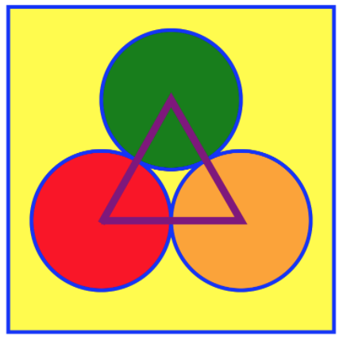

[Home](/README.MD) | [Week 1](../../week-01/ReadMe.md) | [Week 2](../../week-02/ReadMe.md) | [Week 3](../../week-03/ReadMe.md) | [Week 4](../../week-04/ReadMe.md) | [Week 5](../../week-05/ReadMe.md) | [Week 6](../../week-06/ReadMe.md) | [Week 7](../../week-07/ReadMe.md) | [Week 8](../../week-08/ReadMe.md) | [Week 9/10](../../week-09_10/ReadMe.md)

Labs: 1 | [2](./lab-02.md) | [3](./lab-03.md) | [4](./lab-04.md) | [5](./lab-05.md) | [6](./lab-06.md) | [7](./lab-07.md)

---


# Week 4 > Lab 1

### SVG

#### Objective

Explore the basics of working with SVG using standard tags/elements.

#### Prerequisites

The following is example svg code that you can use as a reference to help get the lab started:

```
<?xml version="1.0" encoding="UTF-8" ?>

<svg xmlns="http://www.w3.org/2000/svg" version="1.1">
  <rect x="25" y="25" width="200" height="200"
        fill="lime" stroke-width="4" stroke="pink" />
  <circle cx="125" cy="125" r="75" fill="orange" />
  <polyline points="50,150 50,200 200,200 200,100"
            stroke="red" stroke-width="4" fill="none" />
  <line x1="50" y1="50" x2="200" y2="200"
        stroke="blue" stroke-width="4" />
</svg>
```

You can read documentation with examples on SVG [here](https://www.w3schools.com/graphics/svg_intro.asp).

#### Instructions

1. Create an SVG Image that looks like the following image:



2. Use 3 Circles, 1 Rectangle, 1 line

3. To build your SVG image right in a web page, include `svg` tags in your html:

```
<svg width=”800” height=”800”></svg>
```

4. **Bonus:** Try adding a CSS class to the rectangle that changes the fill when you hover over it.
---
[Week 4 Home](../ReadMe.md) | [Go to Lab 2 >>](./lab-02.md)
