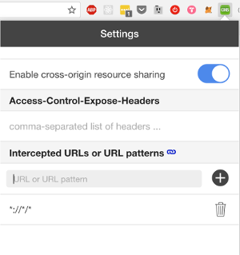

[Home](/README.MD) | [Week 1](../../week-01/ReadMe.md) | [Week 2](../../week-02/ReadMe.md) | [Week 3](../../week-03/ReadMe.md) | [Week 4](../../week-04/ReadMe.md) | [Week 5](../../week-05/ReadMe.md) | [Week 6](../../week-06/ReadMe.md) | [Week 7](../../week-07/ReadMe.md) | [Week 8](../../week-08/ReadMe.md) | [Week 9/10](../../week-09_10/ReadMe.md)

Labs: [1](./lab-01.md) | [2](./lab-02.md) | [3](./lab-03.md) | [4](./lab-04.md) | 5

---

# Week 6 > Lab 5

### Web Requests with Axios

We will build a simple [Giphy](https://developers.giphy.com/) search engine that will use the Giphy api to search for cool gifs.

#### Objective

- Practice React skills using state and event handlers
- Practice using axios with promises

#### Prerequisites

- A developer API from Giphy
- Use `create-react-app` to create a new react project in `brainstation/labs`
- Install axios using `npm install axios`
- Install [CORS toggle](https://chrome.google.com/webstore/detail/cors-toggle/jioikioepegflmdnbocfhgmpmopmjkim?hl=en) to handle the CORS error that will occur when using Javascript to go to giphy in the browser.

#### Part 1 - Build The structure

1. In the `render()` method of `App.js`, build the the basic structure of your app. It should have a search bar, a search button, and an area for displaying images. You may want to use a Bootstrap grid for displaying images

#### Part 2 - Use Axios to get the Giphy trending images

When our app first loads, let's show giphy's trending images.

1. Import the axios library as usual
2. In your browser enable CORS Toggle
3. In `componentDidMount()`, use axios to call the trending api.  

```JavaScript
axios.get('http://api.giphy.com/v1/gifs/trending?api_key=YOUR_API_KEY')
```

4. Turn on the CORS Toggle for your app so that you can properly connect to giphy:



4. `console.log` the response using `.then()`:

```JavaScript
axios.get('http://api.giphy.com/v1/gifs/trending?api_key=YOUR_API_KEY')
  .then((response) => {
    console.log(response.data)
  })
```

5. Add some state to your component that will hold the `images`. e.g)

```JavaScript
this.state = {
  images: []
}
```

6. Using the response that you got back from giphy, add the giphy urls to your arrays

7. using `.map()`, display the images in the `render()` of your component. e.g.)

```JavaScript
let imagesJSX = this.state.images.map((image) => {
  return (
    
  )
})
```

#### Part 3 - Search for gifs

1. Add `searchText` to your state.

2. Add an event handler that will do search giphy when the user clicks on the 'search button'

3. In the event handler, use axios to search giphy for the text the user typed. e.g.)

```JavaScript
  axios
    .get('http://api.giphy.com/v1/gifs/search?q=ryan+gosling&api_key=YOUR_API_KEY')
    .then((response) => {
      //update state here
    })
```

4. Add the images you received in your response to state. You should see the returned images on your pages

5. Add some text above your images that shows the search terms that the user typed. When your page first loads it should say 'Trending', but when the user types it should show: 'Search Results for: Ryan Gosling' (assuming the user searched for Ryan Gosling)

---
[Week 6 Home](../ReadMe.md)
